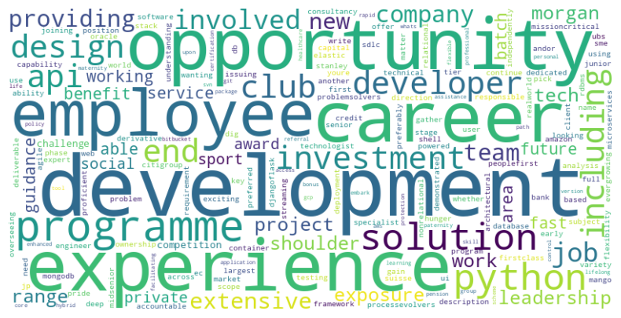
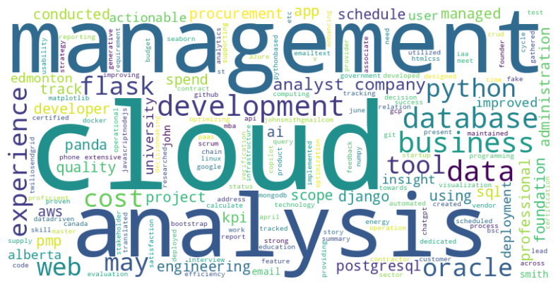

# Natural Language Processing 

**Resume Optimization - A data-driven & programmatic attempt**

Capstone 2 for Osric Dhoubhadel

[Github Link](https://github.com/OsricDhoubhadel/resume-optimization-notebook)

---
## Problem Statement:
- Job application can be a difficult task in current economy
- Calls for tailoring resume to job description
- Doing so manually can be a tedious process
---
## Potential solution:
- Can use a data driven approach via Python & markdown
- Allows for using text as a source of data
- Via one or more of these approaches:
  - Natural Language Processing (NLP)
  - Lightcast APIs
  - Large Language Models APIs (potentially RAG pipeline): *Not discussed here*
---
## Approach 1: NLTK module  

NLTK (Natural Language Toolkit) is a Natural Language Processing library.

*'Natural language processing (NLP) is a subfield of computer science and especially artificial intelligence. It is primarily concerned with providing computers with the ability to process data encoded in natural language and is thus closely related to information retrieval, knowledge representation and computational linguistics, a subfield of linguistics.'*
  -Wikipidea definition

---
### NLTK Processes

- Cleanup: change case (either upper or lower)
- Remove punctuation
- Tokenize the text into words
- Remove stopwords (such as 'the', 'is','and' etc) that don't provide value in understanding context
- Lemmatize which is the process of turning words into their root form (e.g. walked to walk, better to good etc)

---
### NLTK Code

Imports and download of corpus

```python

import nltk
from nltk.tokenize import word_tokenize, sent_tokenize  # For tokenization
from nltk.corpus import stopwords  # For stopword removal
from nltk.stem import PorterStemmer, WordNetLemmatizer  # For stemming and lemmatization
from nltk import pos_tag, ne_chunk  # For POS tagging and Named Entity Recognition (NER)
import string  # For text normalization

# Download necessary datasets (only needed once)
nltk.download('punkt')
nltk.download('punkt_tab')
nltk.download('stopwords')
nltk.download('averaged_perceptron_tagger')
nltk.download('averaged_perceptron_tagger_eng')
nltk.download('wordnet')
nltk.download('maxent_ne_chunker')
nltk.download('words')

```
---

### NLTK Code

```python
def preprocess(text):
    text = text.lower()  # Lowercase
    text = text.translate(str.maketrans('', '', string.punctuation))  # Remove punctuation
    tokens = word_tokenize(text)  # Tokenize
    tokens = [word for word in tokens if word not in stopwords.words('english')]  # Remove stopwords
    lemmatizer = WordNetLemmatizer()
    tokens = [lemmatizer.lemmatize(word) for word in tokens]  # Lemmatization
    return " ".join(tokens)
```
---
### Declare the variable for sample job description

```python
job_description = """
Are you a technologist who has a hunger to dig deep and get involved in providing first-class solutions to real-world problems?

We have opportunities for Mid-Senior Software Engineers .

What will you do?

You will be responsible for the ownership of key projects, working across all phases of the SDLC, including analysis, design, development, testing and deployment. As a Senior Developer, you will be accountable for issuing technical guidance to Junior Developers, including overseeing their deliverables and providing architectural guidance.

What experience will you need?

    Proficient in Python development, Experience in web frameworks preferably Fast API (In use) or with Django/Flask and able to pick up Fast API, API development, exposure to UI
    Using Amazon ECS (Elastic container services)
    Mango DB in scope now and another RDBMS in future
    End to end Python based streaming and batch jobs
    Experience in microservices
    Understanding of both relational and non-relational databases
    Experience with MongoDB and/or Oracle preferred
    Able to write shell & batch programs
    Ability to work independently with end users to gather requirements and design solutions
    Demonstrated Subject Matter Expert (SME) in area(s) of Applications Development
    Experience in version control tools like GIT, SVN and Bitbucket 
```
---
### Declare the variable for sample resume

```python
resume = """
  # JOHN SMITH
  **Email**: john.smith@gmail.com | **Phone**: 123-456-7890 | **Address**: 1234 Fake St, Canada

  ## PROFESSIONAL SUMMARY

  Dedicated Python developer with extensive experience in web development, database management, and data analysis. Proficient in Django and Flask, with proven success in optimizing business processes.

  ## SKILLS

  - **Programming & Web**: Python (Django, Flask) , HTML/CSS, JavaScript/NodeJS
  - **Data & Databases**: SQL, PostgreSQL, MongoDB, Pandas, NumPy, Matplotlib, Seaborn
  - **Tools & Technologies**: Git/ Github, Docker, Linux, AI tools (Copilot, ChatGPT etc)
  - **Cloud Computing**: AWS, Google Cloud, Oracle Cloud

  ## EXPERIENCE

  **Data Analyst** *Company 1 | May 2022 – Present*  

  - **Data Analysis**: Conducted analysis using SQL/ Pandas; created visualizations to track spend.
  - **Database Management**: Managed PostgreSQL for database administration and query optimization.

  ** Analyst** *Company 2 | June 2020 - May 2022*  

  - **Web App Development**: Developed contract KPI evaluation CRUD app with Python Flask and Bootstrap.
  - **Automated Reporting**: Implemented Python-based reports and scheduled status email/text with Twilio/Sendgrid API, enhancing decision-making with actionable insights.
  - **Data-Driven Decisions**: Utilized analytics tools to track KPIs, providing actionable operational insights.

  **Business Analyst** *Company 3 | May 2019 - April 2020*  

  - **Cloud Deployment**: Deployed code to Oracle Cloud and researched cloud providers such as AWS, Azure and GCP for deployment using IaaS vs PaaS strategy.

  ## EDUCATION

  - **B.Sc. in Engineering** | University of Toronto | 2020

```
---
### Run the NLTK preprocess on those text and genereate wordcloud

```python
preprocess(job_description)
preprocess(resume)


from wordcloud import WordCloud # For wordcloud visualization of text

def wordcloud_generator(text):
  # Create a WordCloud object
  wordcloud = WordCloud(width=800, height=400, background_color="white").generate(text)

  # Display the word cloud
  plt.figure(figsize=(10, 5))
  plt.imshow(wordcloud, interpolation="bilinear")
  plt.axis("off")  # Hide axes
  plt.show()
```
---
### Wordcloud visualization: job description
```python
wordcloud_generator(preprocess(job_description))
```


---
### Wordcloud visualization: resume
```python
wordcloud_generator(preprocess(resume))
```


---
### Cosine similarity - Background

See how similar the tokens are based on cosine of tokens 


[Figure source](https://blogs.ischool.berkeley.edu/w231/2021/05/31/machine-learning-bias-in-word-embedding-algorithms/)

---
### Cosine similarity - Code

```python
# Import sklearn
from sklearn.feature_extraction.text import TfidfVectorizer
from sklearn.metrics.pairwise import cosine_similarity

# Convert texts into TF-IDF vectors
vectorizer = TfidfVectorizer()
tfidf_matrix = vectorizer.fit_transform([preprocess(job_description), preprocess(resume)])

# Compute cosine similarity
cosine_sim = cosine_similarity(tfidf_matrix[0], tfidf_matrix[1])

print(f"Cosine Similarity: {cosine_sim[0][0]:.4f}")


<Result: Cosine Similarity: 0.1568>
````
---
## Approach 2: Lightcast skills API

Use of an API by passing a string of text and viewing the list of skills and confidence level

---

### Lightcast API documentation

Link: 
https://docs.lightcast.dev/apis/skills#versions-version-extract

---
## Lightcast API code

```python
import requests

def get_access_token(EMSI_CLIENT_ID, EMSI_CLIENT_SECRET):
    """Retrieves an access token."""
    url = "https://auth.emsicloud.com/connect/token"
    payload = f"client_id={EMSI_CLIENT_ID}&client_secret={EMSI_CLIENT_SECRET}&grant_type=client_credentials&scope=emsi_open"
    headers = {"Content-Type": "application/x-www-form-urlencoded"}

    response = requests.request("POST", url, data=payload, headers=headers)
    return response.json()

def get_skills(text, access_token, confidence_threshold=0.6):
    """Retrieves the latest skills data."""
    url = "https://emsiservices.com/skills/versions/latest/extract"

    payload = {
    "text": text,
    "confidenceThreshold": confidence_threshold
    }
    headers = {
        "Authorization": f"Bearer {access_token}",
        "Content-Type": "application/json"
    }

    try:
        response = requests.request("POST", url, json=payload, headers=headers)
        response.raise_for_status()
        return response.json()
    except requests.exceptions.RequestException as e:
        print(f"Error getting skills: {e}")
        return None
```

---
### Lightcast API Code (Continued)

```python
access_token = get_access_token(EMSI_CLIENT_ID, EMSI_CLIENT_SECRET)["access_token"]

# Running it twice: once for skills in job description and second for skills found in resume
job_skills = get_skills(text= job_description, access_token = access_token, confidence_threshold=0.4)
current_skills = get_skills(text= resume, access_token = access_token, confidence_threshold=0.4)

# Convert skills to DataFrame
def skill_to_df(skills):
  df = pd.DataFrame({
    'Skill Name': [item['skill']['name'] for item in skills['data']],
    'Confidence Level': [item['confidence'] for item in skills['data']]})
  return df

# Run it for job_skills and current_skills
job_skills_df = skill_to_df(job_skills)
current_skills_df = skill_to_df(current_skills)

print(job_skills_df.head(10))
print("\n")
print(current_skills_df.head(10))
```
---
### Lightcast API Code (Results)
```python
                        Skill Name  Confidence Level
0                     Relational Databases               1.0
1                            Microservices               1.0
2                     Software Engineering               1.0
3             Git (Version Control System)               1.0
4         Amazon Elastic Container Service               1.0
5                      Development Testing               1.0
6                           Web Frameworks               1.0
7            Python (Programming Language)               1.0
8                   Django (Web Framework)               1.0
9  Application Programming Interface (API)               1.0


                           Skill Name  Confidence Level
0  Infrastructure As A Service (IaaS)               1.0
1                     Cloud Computing               1.0
2                            Sendgrid               1.0
3     Bootstrap (Front-End Framework)               1.0
4                        Oracle Cloud               1.0
5             Database Administration               1.0
6   Key Performance Indicators (KPIs)               1.0
7                              Twilio               1.0
8                     Microsoft Azure               1.0
9         Google Cloud Platform (GCP)               1.0
```
---
### See whats matched, missing and extra

```python
# Convert DataFrames to sets
job_skills = set(job_skills_df['Skill Name'])
resume_skills = set(current_skills_df['Skill Name'])

# Identify skill categories
common_skills = job_skills & resume_skills
missing_skills = job_skills - resume_skills
extra_skills = resume_skills - job_skills

# Print results in a structured format
print("✅ Matched Skills:")
print("\n".join(common_skills) if common_skills else "None")

print("\n❌ Missing from Resume:")
print("\n".join(missing_skills) if missing_skills else "None")

print("\n➕ Extra in Resume:")
print("\n".join(extra_skills) if extra_skills else "None")

```
---
### See whats matched, missing and extra

```python
✅ Matched Skills:
Python (Programming Language)
MongoDB
Flask (Web Framework)
Django (Web Framework)
Git (Version Control System)

❌ Missing from Resume:
User Interface (UI)
Web Frameworks
Relational Database Management Systems
Microservices
Relational Databases
Systems Development Life Cycle
Application Programming Interface (API)
Version Control
Amazon Elastic Container Service
Development Testing
Software Engineering
Bitbucket
Apache Subversion

➕ Extra in Resume:
Google Cloud Platform (GCP)
Infrastructure As A Service (IaaS)
PostgreSQL
SQL (Programming Language)
Bootstrap (Front-End Framework)
Node.js (Javascript Library)
Cloud Computing
```
---
## Possible future

- Clustering of vectors converted from words
- LLM integration
- A/B testing
